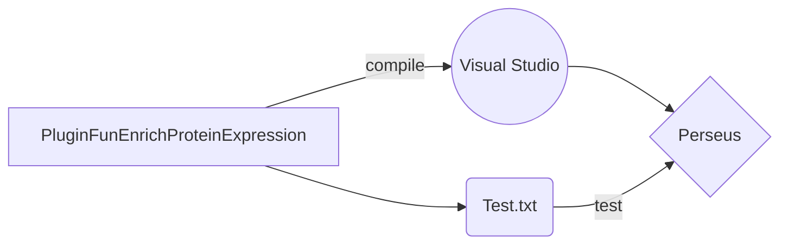

# Steps to compile and test

* download  [Perseus](https://maxquant.org/download_asset/perseus/latest) 
* dowload [Visual Studio](https://visualstudio.microsoft.com/thank-you-downloading-visual-studio/?sku=community&ch=pre&rel=16#) *(VS)*
* `git clone https://github.com/animesh/perseus-plugins.git`
* open "perseus-plugins\PluginFunEnrichProteinExpression\PluginFunEnrichProteinExpression.csproj" solution in VS annd right click and build the project from "Solution" dropdown in VS
* copy the created "PluginFunEnrichProteinExpression.dll" from "\PluginFunEnrichProteinExpression\bin\Debug\netstandard2.0\" folder into the "Perseus_1.6.5.0\Perseus\bin\" folder, should appear as "AddFun" dropdown in "Processsing" menu as "FunEnrichProteinExpression"
* test against https://string-db.org/cgi/input.pl?input_page_active_form=proteins_with_values example available as [test.txt](https://github.com/animesh/perseus-plugins/tree/master/PluginFunEnrichProteinExpression/Test.txt) file in this plugin directory "perseus-plugins\PluginFunEnrichProteinExpression" with "Matrix access set to "Columns" while calling the function through Perseus (v1.6.5)

