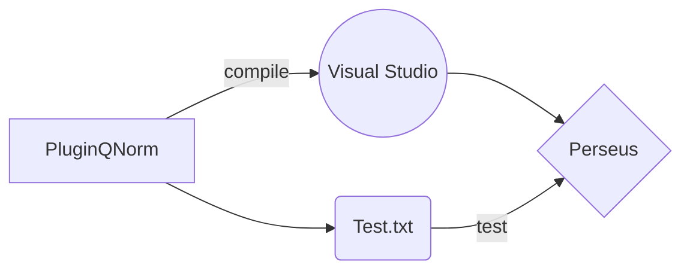

# Steps to compile and test

* download  [Perseus](https://maxquant.org/download_asset/perseus/latest) 
* dowload [Visual Studio](https://visualstudio.microsoft.com/thank-you-downloading-visual-studio/?sku=community&ch=pre&rel=16#) *(VS)*
* `git clone https://github.com/animesh/perseus-plugins.git`
* open "perseus-plugins\PluginQNorm\PluginQNorm.csproj" solution in VS annd right click and build the project from "Solution" dropdown in VS
* copy the created "PluginQNorm.dll" from "perseus-plugins\PluginQNorm\bin\Debug\" folder into the "Perseus_1.6.5.0\Perseus\bin\" folder, should appear as "AddFun" dropdown in "Processsing" menu as "Qnorm"
* tested against https://davetang.org/muse/2014/07/07/quantile-normalisation-in-r/ example available as [test.txt](https://github.com/animesh/perseus-plugins/tree/master/PluginQNorm/Test.txt) file in this plugin directory "perseus-plugins\PluginQNorm" with "Matrix access set to "Columns" while calling the function through Perseus (v1.6.5)

